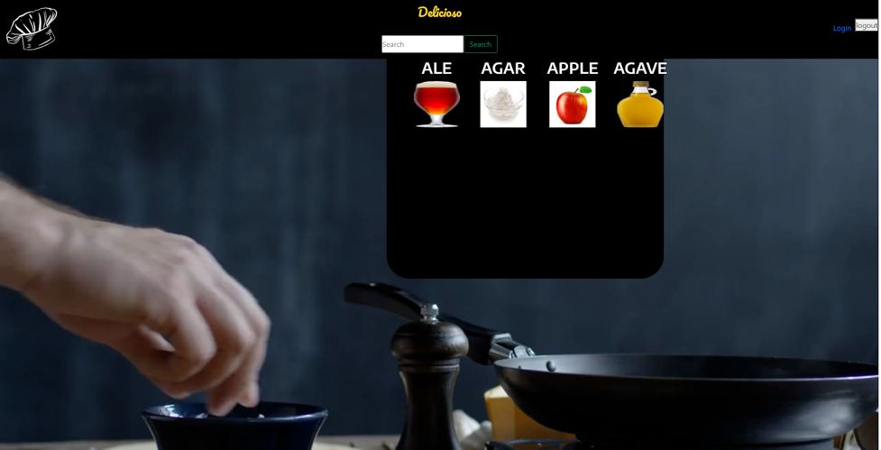

# Delicioso!

## Description
---
**Delicioso** helps users create recipes from the limited ingredients that may be available in the user's cupboards/refrigerator. 

## Technology
---
This platform uses several technologies in the front end: [GSAP 3](https://greensock.com/3/), [Bodymovin](https://aescripts.com/bodymovin/), [Lottie](http://airbnb.io/lottie/#/); several on the back end: [MySQL](https://www.mysql.com/), [Sequelize](https://sequelize.org/), [Handlebars](https://handlebarsjs.com/), [ Express.js](https://expressjs.com/), [JawsDB](https://www.jawsdb.com/); and with the API, [Spoonacular](https://spoonacular.com/food-api).

## What's For Dinner?
---
From the home screen, log-in/create an account.

Enter a few ingredients that you have and select a recipe with them.

## Deployment
---
[Delicioso](https://dry-plateau-78238.herokuapp.com/login) as deployed on [Heroku](https://heroku.com)

[Delicioso Repository]() on [GitHub](https://github.com)

### Development Team
---
### Ayad Al Shaikhli
### Sean Mandell
### Francisco Sandoval
### Louie Vincelli